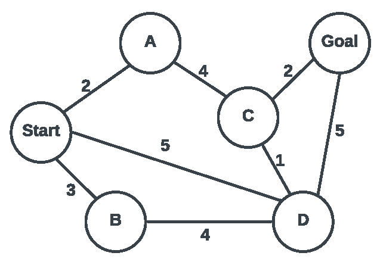

# Andre Thompson
## CS4200_SP24_Assignment03_UninformedSearch
**The Towers of Hanoi is a famous problem in computer science. We start with N discs of varying sizes on a peg (stacked in order according to size), and two empty pegs. We are allowed to move a disc from one peg to another, but we are never allowed to move a larger disc on top of a smaller disc. The goal is to move all the discs to the leftmost peg.**  
  
**For example, state space representation for the problem is defined as: state space representation would be to store three lists, corresponding to which discs are on which peg. If we assume that the N discs are numbered in order of increasing size 1, ..., n, then we can represent each peg as an ordered list of integers corresponding to which discs are on that peg.**  
**What is the size of the state space?**  
-Assuming N represents the total number of discs, the size of the state space can be represented by 3^N as each disc has three possible pegs that each can hold N number of discs.  
**What is the initial state?**  
-The initial state in this problem begins with N discs placed on the left-most peg with larger discs placed below the smaller ones.    
**What is the action space?** 
-The action space defines valid moves for each disc. Each disc is only able to be moved from the top of a peg to another peg with a larger disc on the bottom.  
**What is the goal test?**  
-The goal test checks if all discs have been moved to the left-most peg where discs are stacked largest to smallest in ascending order.   

**Uninformed search is an important topics in AI. Given the map below, you need to apply tree search and graph search to solve the path problem. For each of the following search strategies, work out the order in which states are expanded, as well as the path returned by graph search. In all cases, assume ties resolve in such a way that states with earlier alphabetical order are expanded first. Remember that in graph search, a state is expanded only once.**  
    
**Depth-first tree search**  
-Start  
-A  
-C  
-Goal 
-B  
-D   
-Path returned: root->A->C->goal  
**Depth-first graph search**  
-Start  
-A  
-C  
-Goal  
-B  
-D  
-Path returned: root->A->C->goal  
**Breadth-first tree search**  
-Start  
-A  
-B  
-C  
-Goal  
-D  
-Path returned: root->A->B->C->goal  
**Breadth-first graph search**  
-Start  
-A  
-B  
-C  
-Goal  
-D  
-Path returned: root->A->B->C->goal  
**Uniform cost graph search**  
-Start  
-A  
-C  
-Goal  
-B  
-D  
-Path returned: root->A->C->goal  

